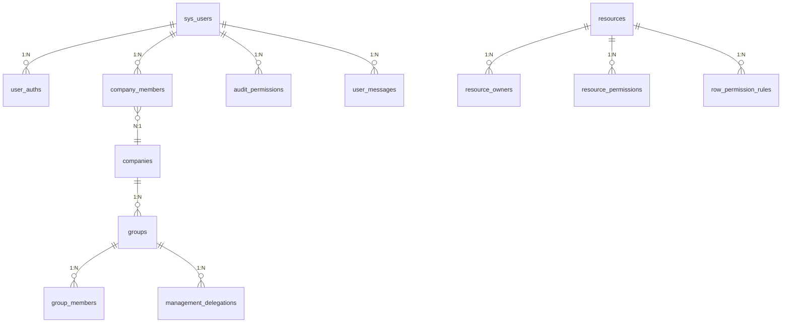

# CRM 系统用户与权限管理数据库详细设计文档 (PostgreSQL 版)

## 1. 概述与设计原则

### 1.1 设计背景与目标

本数据库设计文档依据 CRM 系统的用户管理与权限管理需求编写，旨在提供高并发、易扩展、严密安全的底层数据架构。系统需要支持手机号/微信多端认证、三种用户身份（普通用户、企业用户、系统用户）、企业多级分组与管理分级授权、资料库/文件夹/文件细粒度资源控制、数据行级权限过滤，以及针对审计人员与客服人员的日志及信息调阅管理。

### 1.2 数据库设计规范

- **数据库引擎**：采用 pgvector/pgvector:pg16 ，全面支持 ACID 事务、强约束及原生的 `JSONB` 高效数据类型。
- **字符集与排序规则**：统一采用 `UTF8` 字符集，完美支持多语言与 Emoji 表情。
- **命名规范**：
  - 数据库表名、字段名采用小写蛇形命名法（`snake_case`）。
  - 布尔或短状态标记统一采用 `SMALLINT`，明确标注枚举含义。
  - 时间字段统一采用 `TIMESTAMP`，默认值设为 `CURRENT_TIMESTAMP`。
- **主键策略**：物理主键统一采用 `BIGINT GENERATED BY DEFAULT AS IDENTITY`，分布式扩展预留由业务生成的唯一编号（如 `user_no`, `company_no` 等）。由于 PostgreSQL 不支持无符号整型，MySQL 中的 `UNSIGNED` 约束在此省略。
- **软删除规范**：核心数据表保留 `deleted_at` 逻辑删除字段（默认 `NULL`），建立索引时需结合逻辑删除状态进行优化。
- **记录级有效期（v3.7）**：**所有业务表统一增加 `valid_from` 与 `valid_until` 时间字段**，用于决定当前记录是否可用：
  - `valid_from TIMESTAMP NOT NULL DEFAULT CURRENT_TIMESTAMP`：记录生效起始时间（创建即生效）；
  - `valid_until TIMESTAMP DEFAULT NULL`：记录失效时间，`NULL` 表示一直有效；
  - **有效性判定**：`valid_from <= 当前时间 AND (valid_until IS NULL OR valid_until >= 当前时间)`；
  - **删除 / 失效语义**：业务上删除记录或使记录无效，统一通过设置 `valid_until = CURRENT_TIMESTAMP` 实现（逻辑失效），**不做物理删除**；
  - 已具备有效期的表（`resource_owners`、`resource_permissions`）沿用该模型；`sys_users.deleted_at` 保留为兼容字段，逻辑删除以 `valid_until` 为准。
- **自动更新时间**：利用 PostgreSQL 的 `TRIGGER` 与 `PL/pgSQL` 函数替代 MySQL 的 `ON UPDATE CURRENT_TIMESTAMP` 特性。

---

## 2. 总体 ER 关系与架构设计



---

## 3. 详细数据表设计

### 3.1 用户与认证模块

#### 3.1.1 用户主表 (`sys_users`)

存储系统全局用户基础账户信息，不区分普通用户与企业用户，具体企业身份由成员表表达。

| 字段名 | 数据类型 | 允许空 | 默认值 | 说明 |
| :--- | :--- | :--- | :--- | :--- |
| `user_id` | BIGINT | 否 | 自动生成 | 用户ID（主键） |
| `user_no` | VARCHAR(64) | 否 | - | 用户全局唯一编号 (业务标识) |
| `phone` | VARCHAR(20) | 否 | - | 接收验证码手机号 |
| `nickname` | VARCHAR(64) | 否 | '' | 用户显示昵称 |
| `avatar_url` | VARCHAR(255) | 是 | NULL | 用户头像 URL |
| `status` | SMALLINT | 否 | 1 | 状态：1-正常, 2-禁用, 3-已注销 |
| `system_role` | VARCHAR(32) | 否 | 'NONE' | 系统顶级角色：NONE, SYSTEM_ADMIN, AUDITOR, CUSTOMER_SERVICE |
| `valid_from` | TIMESTAMP | 否 | CURRENT_TIMESTAMP | 记录生效起始时间 |
| `valid_until` | TIMESTAMP | 是 | NULL | 记录失效时间（NULL 一直有效；注销/禁用记录设此字段） |
| `created_at` | TIMESTAMP | 否 | CURRENT_TIMESTAMP | 账号创建时间 |
| `updated_at` | TIMESTAMP | 否 | CURRENT_TIMESTAMP | 账号更新时间（触发器维护） |
| `deleted_at` | TIMESTAMP | 是 | NULL | 软删除标记 |

- **索引设置**：主键 `user_id`，唯一索引 `uk_user_no (user_no)`，普通索引 `idx_status_role (status, system_role)`。

#### 3.1.2 认证标识表 (`user_auths`)

支持多端登录绑定（手机号密码/验证码、微信等）。一个用户可绑定一种或多种认证方式。

| 字段名 | 数据类型 | 允许空 | 默认值 | 说明 |
| :--- | :--- | :--- | :--- | :--- |
| `auth_id` | BIGINT | 否 | 自动生成 | 认证ID（主键） |
| `user_id` | BIGINT | 否 | - | 关联 `sys_users.user_id` |
| `auth_type` | VARCHAR(20) | 否 | - | 认证类型：`PHONE` (手机号), `WECHAT` (微信) |
| `identifier` | VARCHAR(128) | 否 | - | 认证标识（手机号、微信 unionid/openid） |
| `credential` | VARCHAR(255) | 是 | '' | 凭证（密码 Hash 等） |
| `verified_at` | TIMESTAMP | 是 | NULL | 认证/验证通过时间 |
| `status` | SMALLINT | 否 | 1 | 状态：1-启用, 0-禁用 |
| `valid_from` | TIMESTAMP | 否 | CURRENT_TIMESTAMP | 记录生效起始时间 |
| `valid_until` | TIMESTAMP | 是 | NULL | 记录失效时间（NULL 一直有效；解绑/失效设此字段） |
| `created_at` | TIMESTAMP | 否 | CURRENT_TIMESTAMP | 创建/绑定时间 |
| `updated_at` | TIMESTAMP | 否 | CURRENT_TIMESTAMP | 更新时间 |

- **索引设置**：主键 `auth_id`，唯一索引 `uk_auth_identifier (auth_type, identifier)`，普通索引 `idx_user_id (user_id)`。

#### 3.1.3 短信验证码记录表 (`sms_verifications`)

记录验证码发送、验证与防刷记录。

| 字段名 | 数据类型 | 允许空 | 默认值 | 说明 |
| :--- | :--- | :--- | :--- | :--- |
| `id` | BIGINT | 否 | 自动生成 | 主键ID |
| `phone` | VARCHAR(20) | 否 | - | 接收验证码手机号 |
| `code_hash` | VARCHAR(128) | 否 | - | 验证码 Hash |
| `scene` | VARCHAR(30) | 否 | - | 业务场景：`REGISTER`, `LOGIN`, `BIND`, `RESET_PWD` |
| `expired_at` | TIMESTAMP | 否 | - | 过期时间 |
| `used_at` | TIMESTAMP | 是 | NULL | 使用消耗时间 |
| `attempts` | SMALLINT | 否 | 0 | 尝试校验错误次数 |
| `ip_address` | VARCHAR(45) | 是 | '' | 请求客户端 IP |
| `valid_from` | TIMESTAMP | 否 | CURRENT_TIMESTAMP | 记录生效起始时间 |
| `valid_until` | TIMESTAMP | 是 | NULL | 记录失效时间（NULL 一直有效） |
| `created_at` | TIMESTAMP | 否 | CURRENT_TIMESTAMP | 发送时间 |

- **索引设置**：主键 `id`，组合索引 `idx_phone_scene (phone, scene, created_at)`。

#### 3.1.4 用户消息中心表 (`user_messages`)

站内消息中心：每个用户拥有独立消息列表，接收系统消息。申请加入企业时通知企业管理员（`JOIN_REQUEST`），企业邀请用户加入时通知被邀请用户（`INVITATION`）。当前不通过短信发送额外提醒，`sms_notified` 字段预留短信通知扩展点。

| 字段名 | 数据类型 | 允许空 | 默认值 | 说明 |
| :--- | :--- | :--- | :--- | :--- |
| `message_id` | BIGINT | 否 | 自动生成 | 消息ID（主键） |
| `user_id` | BIGINT | 否 | - | 接收者用户ID（关联 `sys_users.user_id`） |
| `message_type` | VARCHAR(30) | 否 | - | 消息类型：`SYSTEM`（系统消息）、`JOIN_REQUEST`（申请加入企业）、`INVITATION`（企业邀请加入） |
| `title` | VARCHAR(128) | 否 | - | 消息标题 |
| `content` | VARCHAR(512) | 否 | '' | 消息正文（含企业名 / 用户昵称等） |
| `related_company_id` | BIGINT | 是 | NULL | 关联企业ID（申请 / 邀请消息填充） |
| `related_user_id` | BIGINT | 是 | NULL | 关联用户ID（申请发起人 / 邀请发起人） |
| `is_read` | SMALLINT | 否 | 0 | 是否已读：0-未读, 1-已读 |
| `read_at` | TIMESTAMP | 是 | NULL | 已读时间 |
| `sms_notified` | SMALLINT | 否 | 0 | 短信通知标记：0-未发短信（当前固定），1-已发短信（后续短信通道接入后） |
| `valid_from` | TIMESTAMP | 否 | CURRENT_TIMESTAMP | 记录生效起始时间 |
| `valid_until` | TIMESTAMP | 是 | NULL | 记录失效时间（NULL 一直有效） |
| `created_at` | TIMESTAMP | 否 | CURRENT_TIMESTAMP | 消息创建时间 |

- **索引设置**：主键 `message_id`，普通索引 `idx_msg_user_created (user_id, created_at)`、`idx_msg_user_read (user_id, is_read)`。

#### 3.1.5 系统参数表 (`system_settings`)

存储系统级全局配置参数（K/V 结构），如个人 / 企业存储配额上限等，由系统管理员维护。

| 字段名 | 数据类型 | 允许空 | 默认值 | 说明 |
| :--- | :--- | :--- | :--- | :--- |
| `id` | BIGINT | 否 | 自动生成 | 参数ID（主键） |
| `setting_key` | VARCHAR(64) | 否 | - | 参数键（唯一） |
| `setting_value` | VARCHAR(255) | 否 | '' | 参数值 |
| `description` | VARCHAR(255) | 是 | '' | 参数说明 |
| `updated_by` | BIGINT | 是 | NULL | 最近更新人用户ID |
| `valid_from` | TIMESTAMP | 否 | CURRENT_TIMESTAMP | 记录生效起始时间 |
| `valid_until` | TIMESTAMP | 是 | NULL | 记录失效时间（NULL 一直有效；停用参数设此字段） |
| `created_at` | TIMESTAMP | 否 | CURRENT_TIMESTAMP | 创建时间 |
| `updated_at` | TIMESTAMP | 否 | CURRENT_TIMESTAMP | 更新时间 |

- **索引设置**：主键 `id`，唯一索引 `uk_setting_key (setting_key)`。
- **预置参数**：
  - `storage.quota.personal`：个人存储上限（字节），默认 `209715200`（200MB）；
  - `storage.quota.company`：企业存储上限（字节），默认 `10737418240`（10GB）。

#### 3.1.6 个体存储配额表 (`storage_quotas`)

存储**单个用户 / 个别企业**的专属存储配额（字节），**优先于**全局默认配额；由系统管理员维护（UC-031）。

| 字段名 | 数据类型 | 允许空 | 默认值 | 说明 |
| :--- | :--- | :--- | :--- | :--- |
| `id` | BIGINT | 否 | 自动生成 | 配额记录ID（主键） |
| `quota_type` | VARCHAR(20) | 否 | - | 主体类型：USER（用户）/ COMPANY（企业） |
| `subject_id` | BIGINT | 否 | - | 主体ID（用户ID或企业ID） |
| `quota_bytes` | BIGINT | 否 | - | 专属存储上限（字节） |
| `updated_by` | BIGINT | 是 | NULL | 最近更新人用户ID（系统管理员） |
| `valid_from` | TIMESTAMP | 否 | CURRENT_TIMESTAMP | 记录生效起始时间 |
| `valid_until` | TIMESTAMP | 是 | NULL | 记录失效时间（NULL 一直有效；移除配额设此字段） |
| `created_at` | TIMESTAMP | 否 | CURRENT_TIMESTAMP | 创建时间 |
| `updated_at` | TIMESTAMP | 否 | CURRENT_TIMESTAMP | 更新时间 |

- **索引设置**：主键 `id`，唯一约束 `uk_quota_subject (quota_type, subject_id)`。
- **配额优先级**：**个体配额 > 全局默认配额**（`system_settings`）；未设置个体配额的主体使用全局默认值。

---

### 3.2 企业与组织架构模块

#### 3.2.1 企业表 (`companies`)

代表租户（企业空间）。

| 字段名 | 数据类型 | 允许空 | 默认值 | 说明 |
| :--- | :--- | :--- | :--- | :--- |
| `company_id` | BIGINT | 否 | 自动生成 | 企业ID（主键） |
| `company_no` | VARCHAR(64) | 否 | - | 企业唯一业务编号 |
| `name` | VARCHAR(128) | 否 | - | 企业名称 |
| `logo_url` | VARCHAR(255) | 是 | NULL | 企业 Logo |
| `owner_user_id` | BIGINT | 否 | - | 所有者用户ID |
| `status` | SMALLINT | 否 | 1 | 状态：1-正常, 2-禁用, 3-已解散 |
| `valid_from` | TIMESTAMP | 否 | CURRENT_TIMESTAMP | 记录生效起始时间 |
| `valid_until` | TIMESTAMP | 是 | NULL | 记录失效时间（NULL 一直有效；解散/禁用设此字段） |
| `created_at` | TIMESTAMP | 否 | CURRENT_TIMESTAMP | 创建时间 |
| `updated_at` | TIMESTAMP | 否 | CURRENT_TIMESTAMP | 更新时间 |

- **索引设置**：主键 `company_id`，唯一索引 `uk_company_no (company_no)`，普通索引 `idx_owner_user (owner_user_id)`。

#### 3.2.2 企业变更审批表 (`company_approvals`)

记录企业**注销**与**所有权转让**的审批流程（v3.5）：由企业所有者发起，须经**系统管理员或有权限的审计人员**批准后方可生效（UC-033）。

| 字段名 | 数据类型 | 允许空 | 默认值 | 说明 |
| :--- | :--- | :--- | :--- | :--- |
| `approval_id` | BIGINT | 否 | 自动生成 | 审批记录ID（主键） |
| `company_id` | BIGINT | 否 | - | 关联 `companies.company_id` |
| `approval_type` | VARCHAR(20) | 否 | - | 审批类型：`DISSOLVE`（企业注销）/ `TRANSFER`（所有权转让） |
| `requester_user_id` | BIGINT | 否 | - | 发起人用户ID（企业所有者） |
| `target_user_id` | BIGINT | 是 | NULL | 转让目标用户ID（仅 `TRANSFER` 类型） |
| `status` | VARCHAR(20) | 否 | 'PENDING' | 状态：`PENDING`（待审批）/ `APPROVED`（已批准）/ `REJECTED`（已拒绝） |
| `reviewed_by` | BIGINT | 是 | NULL | 审批人用户ID（系统管理员或有权限的审计人员） |
| `review_note` | VARCHAR(255) | 是 | NULL | 审批意见 |
| `reviewed_at` | TIMESTAMP | 是 | NULL | 审批时间 |
| `valid_from` | TIMESTAMP | 否 | CURRENT_TIMESTAMP | 记录生效起始时间 |
| `valid_until` | TIMESTAMP | 是 | NULL | 记录失效时间（NULL 一直有效；撤销申请设此字段） |
| `created_at` | TIMESTAMP | 否 | CURRENT_TIMESTAMP | 申请创建时间 |
| `updated_at` | TIMESTAMP | 否 | CURRENT_TIMESTAMP | 更新时间 |

- **索引设置**：主键 `approval_id`，普通索引 `idx_approval_company (company_id, status)`、`idx_approval_status (status, created_at)`。
- **审批人权限**：系统管理员（`system_role=SYSTEM_ADMIN`），或有权限的审计人员（`audit_scope` 为 `ALL` / `ENTERPRISE_USERS`，且 `scope_details.allowed_company_ids` 未限定或包含该企业）。

---

### 3.3 资源与权限模块

#### 3.3.1 统一资源实体表 (`resources`)

统一承载资料库（LIBRARY）、文件夹（FOLDER）、文件（FILE）三种资源类型，支持树状层级（`parent_resource_id`）。

| 字段名 | 数据类型 | 允许空 | 默认值 | 说明 |
| :--- | :--- | :--- | :--- | :--- |
| `resource_id` | BIGINT | 否 | 自动生成 | 资源ID（主键） |
| `resource_no` | VARCHAR(64) | 否 | - | 资源唯一业务编号 |
| `name` | VARCHAR(255) | 否 | - | 资源名称 |
| `resource_type` | VARCHAR(20) | 否 | - | 资源类型：LIBRARY, FOLDER, FILE |
| `parent_resource_id` | BIGINT | 是 | NULL | 父资源ID（资料库为 NULL） |
| `creator_user_id` | BIGINT | 否 | - | 创建人用户ID（仅记录创建者，不代表唯一所有者） |
| `file_size` | BIGINT | 是 | 0 | 文件大小（字节） |
| `file_type` | VARCHAR(50) | 是 | '' | 文件 MIME 类型 |
| `file_key` | VARCHAR(512) | 是 | '' | **文件相对抽象存储标识符**（如 `USR123/2026/08/26/xxx.pdf`；不存绝对路径，v3.8） |
| `status` | SMALLINT | 否 | 1 | 状态：1-正常, 2-已归档, 3-已删除, 4-待处理（UPLOADED）, 5-处理完成（PROCESSED） |
| `valid_from` | TIMESTAMP | 否 | CURRENT_TIMESTAMP | 记录生效起始时间 |
| `valid_until` | TIMESTAMP | 是 | NULL | 记录失效时间（NULL 一直有效；删除/归档设此字段） |
| `created_at` | TIMESTAMP | 否 | CURRENT_TIMESTAMP | 创建时间 |
| `updated_at` | TIMESTAMP | 否 | CURRENT_TIMESTAMP | 更新时间 |

> 所有权不挂在资源表上，而是由 `resource_owners` 独立维护，支持**多所有者、所有权转让与有效期控制**。

#### 3.3.2 资源所有者表 (`resource_owners`)

维护资源的所有权关系：一个资源可被多个用户或企业共同拥有，所有权支持转让，并受有效期约束（起始可用日期必填，未设置过期时间则一直有效）。

| 字段名 | 数据类型 | 允许空 | 默认值 | 说明 |
| :--- | :--- | :--- | :--- | :--- |
| `ownership_id` | BIGINT | 否 | 自动生成 | 所有权记录ID（主键） |
| `resource_id` | BIGINT | 否 | - | 关联 `resources.resource_id` |
| `owner_type` | VARCHAR(20) | 否 | - | 所有者类型：USER（个人用户）/ COMPANY（企业） |
| `owner_id` | BIGINT | 否 | - | 所有者ID（用户ID或企业ID） |
| `valid_from` | TIMESTAMP | 否 | - | **起始可用日期（必填）** |
| `valid_until` | TIMESTAMP | 是 | NULL | 过期时间（**为空表示一直有效**） |
| `granted_by` | BIGINT | 否 | - | 授权/转让来源用户ID（创建者或原所有者） |
| `status` | SMALLINT | 否 | 1 | 状态：1-有效, 0-已撤销/已转让 |
| `created_at` | TIMESTAMP | 否 | CURRENT_TIMESTAMP | 创建时间 |
| `updated_at` | TIMESTAMP | 否 | CURRENT_TIMESTAMP | 更新时间 |

- **索引设置**：主键 `ownership_id`，唯一索引 `uk_resource_owner (resource_id, owner_type, owner_id)`，普通索引 `idx_owner_lookup (owner_type, owner_id, status)`、`idx_owner_validity (resource_id, status, valid_from, valid_until)`。
- **有效期规则**：`valid_from` 必填；`valid_until` 为空表示永久有效；权限判定仅统计 `status = 1` 且当前时间处于 `[valid_from, valid_until]` 区间内的记录。

#### 3.3.3 资源显式授权表 (`resource_permissions`)

将资源权限（READ / WRITE / OWNER）显式授权给分组或用户。**所有权关系本身由 `resource_owners` 维护**，本表用于对非所有者进行细粒度授权（含显式授予完整操作权限 OWNER，不改变所有权关系）。**每条授权均含有效期**：起始可用日期 `valid_from` 必填，过期时间 `valid_until` 可选（为空表示一直有效）。

| 字段名 | 数据类型 | 允许空 | 默认值 | 说明 |
| :--- | :--- | :--- | :--- | :--- |
| `permission_id` | BIGINT | 否 | 自动生成 | 授权记录ID（主键） |
| `resource_id` | BIGINT | 否 | - | 关联 `resources.resource_id` |
| `grantee_type` | VARCHAR(20) | 否 | - | 授权主体类型：GROUP / USER |
| `grantee_id` | BIGINT | 否 | - | 授权主体ID（分组ID或用户ID） |
| `permission_level` | VARCHAR(20) | 否 | - | 权限级别：READ, WRITE, OWNER |
| `valid_from` | TIMESTAMP | 否 | - | **起始可用日期（必填）** |
| `valid_until` | TIMESTAMP | 是 | NULL | 过期时间（**为空表示一直有效**） |
| `granted_by` | BIGINT | 否 | - | 授权人用户ID |
| `created_at` | TIMESTAMP | 否 | CURRENT_TIMESTAMP | 创建时间 |
| `updated_at` | TIMESTAMP | 否 | CURRENT_TIMESTAMP | 更新时间 |

- **索引设置**：主键 `permission_id`，唯一索引 `uk_resource_grantee (resource_id, grantee_type, grantee_id)`，普通索引 `idx_grantee_lookup (grantee_type, grantee_id)`、`idx_grantee_validity (resource_id, permission_level, valid_from, valid_until)`。
- **有效期规则**：`valid_from` 必填；`valid_until` 为空表示永久有效；权限判定仅统计当前时间处于 `[valid_from, valid_until]` 区间内的授权记录。

---

## 4. 高频权限判定与检索 SQL 设计示例

### 4.1 用户对指定资源的最高权限判定 SQL

结合 `WITH RECURSIVE` 支持递归向上查找资源链条（父级继承），逻辑与原查询一致，PostgreSQL 原生完美支持：

```postgresql
-- 查询 user_id = 101 对 resource_id = 505 的有效权限
WITH RECURSIVE ResourceHierarchy AS (
    SELECT resource_id, parent_resource_id, 0 AS depth
    FROM resources
    WHERE resource_id = 505 AND status = 1

    UNION ALL

    SELECT r.resource_id, r.parent_resource_id, rh.depth + 1
    FROM resources r
    INNER JOIN ResourceHierarchy rh ON r.resource_id = rh.parent_resource_id
    WHERE r.status = 1
),
UserCompanyRole AS (
    SELECT cm.company_id, cm.role
    FROM company_members cm
    WHERE cm.user_id = 101 AND cm.status = 1
),
UserGroupIds AS (
    SELECT gm.group_id
    FROM group_members gm
    INNER JOIN groups g ON gm.group_id = g.group_id
    WHERE gm.user_id = 101 AND g.status = 1
),
OwnerEffective AS (
    -- 资源层级中所有处于有效期内的所有权关系：
    -- valid_from <= 当前时间，且 valid_until 为空或 >= 当前时间
    SELECT ro.resource_id,
           (ro.owner_type = 'USER' AND ro.owner_id = 101)          AS is_direct_owner,
           EXISTS (
               SELECT 1 FROM UserCompanyRole ucr
               WHERE ro.owner_type = 'COMPANY' AND ro.owner_id = ucr.company_id
                 AND ucr.role IN ('OWNER', 'ADMIN')
           )                                                       AS is_company_owner
    FROM resource_owners ro
    WHERE ro.status = 1
      AND ro.valid_from <= CURRENT_TIMESTAMP
      AND (ro.valid_until IS NULL OR ro.valid_until >= CURRENT_TIMESTAMP)
)
SELECT
    CASE
        WHEN EXISTS (
            SELECT 1 FROM OwnerEffective oe
            INNER JOIN ResourceHierarchy rh ON oe.resource_id = rh.resource_id
            WHERE oe.is_direct_owner OR oe.is_company_owner
        ) THEN 'OWNER'
        WHEN MAX(perm_rank) = 3 THEN 'OWNER'
        WHEN MAX(perm_rank) = 2 THEN 'WRITE'
        WHEN MAX(perm_rank) = 1 THEN 'READ'
        ELSE 'NONE'
    END AS final_permission
FROM (
    SELECT
        CASE rp.permission_level
            WHEN 'OWNER' THEN 3
            WHEN 'WRITE' THEN 2
            WHEN 'READ' THEN 1
            ELSE 0
        END AS perm_rank
    FROM resource_permissions rp
    INNER JOIN ResourceHierarchy rh ON rp.resource_id = rh.resource_id
    WHERE
        -- 仅统计处于有效期内的授权：valid_from <= 当前时间，且 valid_until 为空或 >= 当前时间
        rp.valid_from <= CURRENT_TIMESTAMP
        AND (rp.valid_until IS NULL OR rp.valid_until >= CURRENT_TIMESTAMP)
        AND (
            (rp.grantee_type = 'USER' AND rp.grantee_id = 101)
            OR
            (rp.grantee_type = 'GROUP' AND rp.grantee_id IN (SELECT group_id FROM UserGroupIds))
        )
) AS CombinedPermissions;
```

### 4.2 审计人员日志检索范围过滤 SQL

将 MySQL 的 `JSON_CONTAINS` 函数转换为 PostgreSQL 的 `JSONB` 包含操作符 `@>`：

```postgresql
-- 审计人员 (user_id = 202) 查询审计日志
SELECT al.* 
FROM audit_logs al
INNER JOIN audit_permissions ap ON ap.user_id = 202
WHERE 
    (ap.expired_at IS NULL OR ap.expired_at > CURRENT_TIMESTAMP)
    AND (
        ap.audit_scope = 'ALL' 
        OR (ap.audit_scope = 'REGULAR_USER' AND al.user_type = 'REGULAR_USER')
        OR (ap.audit_scope = 'COMPANY_USER' AND al.user_type = 'COMPANY_USER')
        OR (
            ap.audit_scope = 'CUSTOM' 
            -- PostgreSQL JSONB 查询语法转换
            AND ap.scope_details->'allowed_company_ids' @> to_jsonb(al.company_id)
        )
    )
    AND al.user_type != 'SYSTEM_ADMIN'
ORDER BY al.created_at DESC
LIMIT 20 OFFSET 0;
```

---

## 5. 完整建库与建表 DDL SQL 脚本

```postgresql
-- =============================================================================
-- CRM 系统用户管理与权限管理 数据库建库建表 DDL 脚本 (PostgreSQL 幂等安全版)
-- =============================================================================

-- 0. 创建通用自动更新时间戳的触发器函数
CREATE OR REPLACE FUNCTION update_timestamp_column()
RETURNS TRIGGER AS $$
BEGIN
    NEW.updated_at = CURRENT_TIMESTAMP;
    RETURN NEW;
END;
$$ LANGUAGE plpgsql;

-- -----------------------------------------------------------------------------
-- 1. 用户主表 (sys_users)
-- -----------------------------------------------------------------------------
CREATE TABLE IF NOT EXISTS sys_users (
  user_id BIGINT GENERATED BY DEFAULT AS IDENTITY PRIMARY KEY,
  user_no VARCHAR(64) NOT NULL,
  nickname VARCHAR(64) NOT NULL DEFAULT '',
  avatar_url VARCHAR(255) DEFAULT NULL,
  status SMALLINT NOT NULL DEFAULT 1,
  system_role VARCHAR(32) NOT NULL DEFAULT 'NONE',
  valid_from TIMESTAMP NOT NULL DEFAULT CURRENT_TIMESTAMP,
  valid_until TIMESTAMP DEFAULT NULL,
  created_at TIMESTAMP NOT NULL DEFAULT CURRENT_TIMESTAMP,
  updated_at TIMESTAMP NOT NULL DEFAULT CURRENT_TIMESTAMP,
  deleted_at TIMESTAMP DEFAULT NULL
);
CREATE UNIQUE INDEX IF NOT EXISTS uk_user_no ON sys_users(user_no);
CREATE INDEX IF NOT EXISTS idx_status_role ON sys_users(status, system_role);

DROP TRIGGER IF EXISTS trg_sys_users_upd ON sys_users;
CREATE TRIGGER trg_sys_users_upd BEFORE UPDATE ON sys_users FOR EACH ROW EXECUTE FUNCTION update_timestamp_column();

-- -----------------------------------------------------------------------------
-- 2. 认证标识表 (user_auths)
-- -----------------------------------------------------------------------------
CREATE TABLE IF NOT EXISTS user_auths (
  auth_id BIGINT GENERATED BY DEFAULT AS IDENTITY PRIMARY KEY,
  user_id BIGINT NOT NULL,
  auth_type VARCHAR(20) NOT NULL,
  identifier VARCHAR(128) NOT NULL,
  credential VARCHAR(255) DEFAULT '',
  verified_at TIMESTAMP DEFAULT NULL,
  status SMALLINT NOT NULL DEFAULT 1,
  valid_from TIMESTAMP NOT NULL DEFAULT CURRENT_TIMESTAMP,
  valid_until TIMESTAMP DEFAULT NULL,
  created_at TIMESTAMP NOT NULL DEFAULT CURRENT_TIMESTAMP,
  updated_at TIMESTAMP NOT NULL DEFAULT CURRENT_TIMESTAMP
);
CREATE UNIQUE INDEX IF NOT EXISTS uk_auth_identifier ON user_auths(auth_type, identifier);
CREATE INDEX IF NOT EXISTS idx_user_id ON user_auths(user_id);

DROP TRIGGER IF EXISTS trg_user_auths_upd ON user_auths;
CREATE TRIGGER trg_user_auths_upd BEFORE UPDATE ON user_auths FOR EACH ROW EXECUTE FUNCTION update_timestamp_column();

-- -----------------------------------------------------------------------------
-- 3. 短信验证码表 (sms_verifications)
-- -----------------------------------------------------------------------------
CREATE TABLE IF NOT EXISTS sms_verifications (
  id BIGINT GENERATED BY DEFAULT AS IDENTITY PRIMARY KEY,
  phone VARCHAR(20) NOT NULL,
  code_hash VARCHAR(128) NOT NULL,
  scene VARCHAR(30) NOT NULL,
  expired_at TIMESTAMP NOT NULL,
  used_at TIMESTAMP DEFAULT NULL,
  attempts SMALLINT NOT NULL DEFAULT 0,
  ip_address VARCHAR(45) DEFAULT '',
  valid_from TIMESTAMP NOT NULL DEFAULT CURRENT_TIMESTAMP,
  valid_until TIMESTAMP DEFAULT NULL,
  created_at TIMESTAMP NOT NULL DEFAULT CURRENT_TIMESTAMP
);
CREATE INDEX IF NOT EXISTS idx_phone_scene ON sms_verifications(phone, scene, created_at);

-- -----------------------------------------------------------------------------
-- 4. 企业表 (companies)
-- -----------------------------------------------------------------------------
CREATE TABLE IF NOT EXISTS companies (
  company_id BIGINT GENERATED BY DEFAULT AS IDENTITY PRIMARY KEY,
  company_no VARCHAR(64) NOT NULL,
  name VARCHAR(128) NOT NULL,
  logo_url VARCHAR(255) DEFAULT NULL,
  owner_user_id BIGINT NOT NULL,
  status SMALLINT NOT NULL DEFAULT 1,
  valid_from TIMESTAMP NOT NULL DEFAULT CURRENT_TIMESTAMP,
  valid_until TIMESTAMP DEFAULT NULL,
  created_at TIMESTAMP NOT NULL DEFAULT CURRENT_TIMESTAMP,
  updated_at TIMESTAMP NOT NULL DEFAULT CURRENT_TIMESTAMP
);
CREATE UNIQUE INDEX IF NOT EXISTS uk_company_no ON companies(company_no);
CREATE INDEX IF NOT EXISTS idx_owner_user ON companies(owner_user_id);

DROP TRIGGER IF EXISTS trg_companies_upd ON companies;
CREATE TRIGGER trg_companies_upd BEFORE UPDATE ON companies FOR EACH ROW EXECUTE FUNCTION update_timestamp_column();

-- -----------------------------------------------------------------------------
-- 5. 企业成员关联表 (company_members)
-- -----------------------------------------------------------------------------
CREATE TABLE IF NOT EXISTS company_members (
  member_id BIGINT GENERATED BY DEFAULT AS IDENTITY PRIMARY KEY,
  company_id BIGINT NOT NULL,
  user_id BIGINT NOT NULL,
  role VARCHAR(20) NOT NULL DEFAULT 'MEMBER',
  status SMALLINT NOT NULL DEFAULT 1,
  joined_at TIMESTAMP DEFAULT NULL,
  valid_from TIMESTAMP NOT NULL DEFAULT CURRENT_TIMESTAMP,
  valid_until TIMESTAMP DEFAULT NULL,
  created_at TIMESTAMP NOT NULL DEFAULT CURRENT_TIMESTAMP,
  updated_at TIMESTAMP NOT NULL DEFAULT CURRENT_TIMESTAMP
);
CREATE UNIQUE INDEX IF NOT EXISTS uk_company_user ON company_members(company_id, user_id);
CREATE INDEX IF NOT EXISTS idx_user_company ON company_members(user_id, company_id, status);

DROP TRIGGER IF EXISTS trg_company_members_upd ON company_members;
CREATE TRIGGER trg_company_members_upd BEFORE UPDATE ON company_members FOR EACH ROW EXECUTE FUNCTION update_timestamp_column();

-- -----------------------------------------------------------------------------
-- 6. 企业分组表 (groups)
-- -----------------------------------------------------------------------------
CREATE TABLE IF NOT EXISTS groups (
  group_id BIGINT GENERATED BY DEFAULT AS IDENTITY PRIMARY KEY,
  company_id BIGINT NOT NULL,
  parent_group_id BIGINT DEFAULT NULL,
  name VARCHAR(64) NOT NULL,
  description VARCHAR(255) DEFAULT '',
  status SMALLINT NOT NULL DEFAULT 1,
  created_by BIGINT NOT NULL,
  valid_from TIMESTAMP NOT NULL DEFAULT CURRENT_TIMESTAMP,
  valid_until TIMESTAMP DEFAULT NULL,
  created_at TIMESTAMP NOT NULL DEFAULT CURRENT_TIMESTAMP,
  updated_at TIMESTAMP NOT NULL DEFAULT CURRENT_TIMESTAMP
);
CREATE INDEX IF NOT EXISTS idx_company_parent ON groups(company_id, parent_group_id);

DROP TRIGGER IF EXISTS trg_groups_upd ON groups;
CREATE TRIGGER trg_groups_upd BEFORE UPDATE ON groups FOR EACH ROW EXECUTE FUNCTION update_timestamp_column();

-- -----------------------------------------------------------------------------
-- 7. 分组成员关联表 (group_members)
-- -----------------------------------------------------------------------------
CREATE TABLE IF NOT EXISTS group_members (
  id BIGINT GENERATED BY DEFAULT AS IDENTITY PRIMARY KEY,
  group_id BIGINT NOT NULL,
  user_id BIGINT NOT NULL,
  group_role VARCHAR(20) NOT NULL DEFAULT 'MEMBER',
  joined_at TIMESTAMP NOT NULL DEFAULT CURRENT_TIMESTAMP,
  valid_from TIMESTAMP NOT NULL DEFAULT CURRENT_TIMESTAMP,
  valid_until TIMESTAMP DEFAULT NULL
);
CREATE UNIQUE INDEX IF NOT EXISTS uk_group_user ON group_members(group_id, user_id);
CREATE INDEX IF NOT EXISTS idx_user_group ON group_members(user_id, group_id);

-- -----------------------------------------------------------------------------
-- 8. 分级管理授权表 (management_delegations)
-- -----------------------------------------------------------------------------
CREATE TABLE IF NOT EXISTS management_delegations (
  delegation_id BIGINT GENERATED BY DEFAULT AS IDENTITY PRIMARY KEY,
  company_id BIGINT NOT NULL,
  group_id BIGINT NOT NULL,
  grantee_user_id BIGINT NOT NULL,
  granted_by BIGINT NOT NULL,
  scope VARCHAR(32) NOT NULL DEFAULT 'GROUP_MANAGE',
  status SMALLINT NOT NULL DEFAULT 1,
  valid_from TIMESTAMP NOT NULL DEFAULT CURRENT_TIMESTAMP,
  valid_until TIMESTAMP DEFAULT NULL,
  created_at TIMESTAMP NOT NULL DEFAULT CURRENT_TIMESTAMP,
  updated_at TIMESTAMP NOT NULL DEFAULT CURRENT_TIMESTAMP
);
CREATE INDEX IF NOT EXISTS idx_company_grantee ON management_delegations(company_id, grantee_user_id, status);
CREATE INDEX IF NOT EXISTS idx_group_id ON management_delegations(group_id);

DROP TRIGGER IF EXISTS trg_management_delegations_upd ON management_delegations;
CREATE TRIGGER trg_management_delegations_upd BEFORE UPDATE ON management_delegations FOR EACH ROW EXECUTE FUNCTION update_timestamp_column();

-- -----------------------------------------------------------------------------
-- 9. 统一资源实体表 (resources)
-- 说明：所有权由 resource_owners 维护，本表不再持有 owner_type/owner_id。
-- -----------------------------------------------------------------------------
CREATE TABLE IF NOT EXISTS resources (
  resource_id BIGINT GENERATED BY DEFAULT AS IDENTITY PRIMARY KEY,
  resource_no VARCHAR(64) NOT NULL,
  name VARCHAR(255) NOT NULL,
  resource_type VARCHAR(20) NOT NULL,
  parent_resource_id BIGINT DEFAULT NULL,
  creator_user_id BIGINT NOT NULL,
  file_size BIGINT DEFAULT 0,
  file_type VARCHAR(50) DEFAULT '',
  file_key VARCHAR(512) DEFAULT '',
  status SMALLINT NOT NULL DEFAULT 1,
  valid_from TIMESTAMP NOT NULL DEFAULT CURRENT_TIMESTAMP,
  valid_until TIMESTAMP DEFAULT NULL,
  created_at TIMESTAMP NOT NULL DEFAULT CURRENT_TIMESTAMP,
  updated_at TIMESTAMP NOT NULL DEFAULT CURRENT_TIMESTAMP
);
CREATE UNIQUE INDEX IF NOT EXISTS uk_resource_no ON resources(resource_no);
CREATE INDEX IF NOT EXISTS idx_parent_id ON resources(parent_resource_id);

DROP TRIGGER IF EXISTS trg_resources_upd ON resources;
CREATE TRIGGER trg_resources_upd BEFORE UPDATE ON resources FOR EACH ROW EXECUTE FUNCTION update_timestamp_column();

-- -----------------------------------------------------------------------------
-- 10. 资源所有者表 (resource_owners)
-- 说明：多所有者、支持转让，含有效期（valid_from 必填，valid_until 为空则一直有效）。
-- -----------------------------------------------------------------------------
CREATE TABLE IF NOT EXISTS resource_owners (
  ownership_id BIGINT GENERATED BY DEFAULT AS IDENTITY PRIMARY KEY,
  resource_id BIGINT NOT NULL,
  owner_type VARCHAR(20) NOT NULL,
  owner_id BIGINT NOT NULL,
  valid_from TIMESTAMP NOT NULL,
  valid_until TIMESTAMP DEFAULT NULL,
  granted_by BIGINT NOT NULL,
  status SMALLINT NOT NULL DEFAULT 1,
  created_at TIMESTAMP NOT NULL DEFAULT CURRENT_TIMESTAMP,
  updated_at TIMESTAMP NOT NULL DEFAULT CURRENT_TIMESTAMP
);
CREATE UNIQUE INDEX IF NOT EXISTS uk_resource_owner ON resource_owners(resource_id, owner_type, owner_id);
CREATE INDEX IF NOT EXISTS idx_owner_lookup ON resource_owners(owner_type, owner_id, status);
CREATE INDEX IF NOT EXISTS idx_owner_validity ON resource_owners(resource_id, status, valid_from, valid_until);

DROP TRIGGER IF EXISTS trg_resource_owners_upd ON resource_owners;
CREATE TRIGGER trg_resource_owners_upd BEFORE UPDATE ON resource_owners FOR EACH ROW EXECUTE FUNCTION update_timestamp_column();

-- -----------------------------------------------------------------------------
-- 11. 资源显式授权表 (resource_permissions)
-- 说明：所有权关系由 resource_owners 维护；本表负责 READ/WRITE/OWNER 显式授权
--       （含有效期：valid_from 必填，valid_until 为空则一直有效）。
-- -----------------------------------------------------------------------------
CREATE TABLE IF NOT EXISTS resource_permissions (
  permission_id BIGINT GENERATED BY DEFAULT AS IDENTITY PRIMARY KEY,
  resource_id BIGINT NOT NULL,
  grantee_type VARCHAR(20) NOT NULL,
  grantee_id BIGINT NOT NULL,
  permission_level VARCHAR(20) NOT NULL,
  valid_from TIMESTAMP NOT NULL,
  valid_until TIMESTAMP DEFAULT NULL,
  granted_by BIGINT NOT NULL,
  created_at TIMESTAMP NOT NULL DEFAULT CURRENT_TIMESTAMP,
  updated_at TIMESTAMP NOT NULL DEFAULT CURRENT_TIMESTAMP
);
CREATE UNIQUE INDEX IF NOT EXISTS uk_resource_grantee ON resource_permissions(resource_id, grantee_type, grantee_id);
CREATE INDEX IF NOT EXISTS idx_grantee_lookup ON resource_permissions(grantee_type, grantee_id);
CREATE INDEX IF NOT EXISTS idx_grantee_validity ON resource_permissions(resource_id, permission_level, valid_from, valid_until);

DROP TRIGGER IF EXISTS trg_resource_permissions_upd ON resource_permissions;
CREATE TRIGGER trg_resource_permissions_upd BEFORE UPDATE ON resource_permissions FOR EACH ROW EXECUTE FUNCTION update_timestamp_column();

-- -----------------------------------------------------------------------------
-- 12. 数据行级权限规则表 (row_permission_rules)
-- -----------------------------------------------------------------------------
CREATE TABLE IF NOT EXISTS row_permission_rules (
  rule_id BIGINT GENERATED BY DEFAULT AS IDENTITY PRIMARY KEY,
  resource_id BIGINT NOT NULL,
  grantee_type VARCHAR(20) NOT NULL,
  grantee_id BIGINT NOT NULL,
  rule_type VARCHAR(32) NOT NULL,
  filter_expression JSONB DEFAULT NULL,
  status SMALLINT NOT NULL DEFAULT 1,
  created_by BIGINT NOT NULL,
  valid_from TIMESTAMP NOT NULL DEFAULT CURRENT_TIMESTAMP,
  valid_until TIMESTAMP DEFAULT NULL,
  created_at TIMESTAMP NOT NULL DEFAULT CURRENT_TIMESTAMP,
  updated_at TIMESTAMP NOT NULL DEFAULT CURRENT_TIMESTAMP
);
CREATE INDEX IF NOT EXISTS idx_resource_grantee ON row_permission_rules(resource_id, grantee_type, grantee_id);

DROP TRIGGER IF EXISTS trg_row_permission_rules_upd ON row_permission_rules;
CREATE TRIGGER trg_row_permission_rules_upd BEFORE UPDATE ON row_permission_rules FOR EACH ROW EXECUTE FUNCTION update_timestamp_column();

-- -----------------------------------------------------------------------------
-- 13. 审计查看权限表 (audit_permissions)
-- -----------------------------------------------------------------------------
CREATE TABLE IF NOT EXISTS audit_permissions (
  id BIGINT GENERATED BY DEFAULT AS IDENTITY PRIMARY KEY,
  user_id BIGINT NOT NULL,
  audit_scope VARCHAR(32) NOT NULL,
  scope_details JSONB DEFAULT NULL,
  granted_by BIGINT NOT NULL,
  expired_at TIMESTAMP DEFAULT NULL,
  valid_from TIMESTAMP NOT NULL DEFAULT CURRENT_TIMESTAMP,
  valid_until TIMESTAMP DEFAULT NULL,
  created_at TIMESTAMP NOT NULL DEFAULT CURRENT_TIMESTAMP,
  updated_at TIMESTAMP NOT NULL DEFAULT CURRENT_TIMESTAMP,
  CONSTRAINT uk_user_audit UNIQUE (user_id)
);

DROP TRIGGER IF EXISTS trg_audit_permissions_upd ON audit_permissions;
CREATE TRIGGER trg_audit_permissions_upd BEFORE UPDATE ON audit_permissions FOR EACH ROW EXECUTE FUNCTION update_timestamp_column();

-- -----------------------------------------------------------------------------
-- 14. 系统审计日志表 (audit_logs)
-- -----------------------------------------------------------------------------
CREATE TABLE IF NOT EXISTS audit_logs (
  log_id BIGINT GENERATED BY DEFAULT AS IDENTITY PRIMARY KEY,
  user_id BIGINT NOT NULL,
  user_type VARCHAR(32) NOT NULL,
  company_id BIGINT DEFAULT NULL,
  action VARCHAR(64) NOT NULL,
  resource_type VARCHAR(32) DEFAULT '',
  resource_id VARCHAR(64) DEFAULT '',
  detail JSONB DEFAULT NULL,
  ip_address VARCHAR(45) DEFAULT '',
  user_agent VARCHAR(255) DEFAULT '',
  status SMALLINT NOT NULL DEFAULT 1,
  valid_from TIMESTAMP NOT NULL DEFAULT CURRENT_TIMESTAMP,
  valid_until TIMESTAMP DEFAULT NULL,
  created_at TIMESTAMP NOT NULL DEFAULT CURRENT_TIMESTAMP
);
CREATE INDEX IF NOT EXISTS idx_user_created ON audit_logs(user_id, created_at);
CREATE INDEX IF NOT EXISTS idx_company_created ON audit_logs(company_id, created_at);
CREATE INDEX IF NOT EXISTS idx_user_type_created ON audit_logs(user_type, created_at);
CREATE INDEX IF NOT EXISTS idx_action ON audit_logs(action);

-- -----------------------------------------------------------------------------
-- 15. 用户消息中心表 (user_messages)
-- 说明：站内消息中心；消息类型 SYSTEM / JOIN_REQUEST / INVITATION。
--       sms_notified 预留短信通知扩展点（当前不通过短信发送额外提醒）。
-- -----------------------------------------------------------------------------
CREATE TABLE IF NOT EXISTS user_messages (
  message_id BIGINT GENERATED BY DEFAULT AS IDENTITY PRIMARY KEY,
  user_id BIGINT NOT NULL,
  message_type VARCHAR(30) NOT NULL,
  title VARCHAR(128) NOT NULL,
  content VARCHAR(512) NOT NULL DEFAULT '',
  related_company_id BIGINT DEFAULT NULL,
  related_user_id BIGINT DEFAULT NULL,
  is_read SMALLINT NOT NULL DEFAULT 0,
  read_at TIMESTAMP DEFAULT NULL,
  sms_notified SMALLINT NOT NULL DEFAULT 0,
  valid_from TIMESTAMP NOT NULL DEFAULT CURRENT_TIMESTAMP,
  valid_until TIMESTAMP DEFAULT NULL,
  created_at TIMESTAMP NOT NULL DEFAULT CURRENT_TIMESTAMP
);
CREATE INDEX IF NOT EXISTS idx_msg_user_created ON user_messages(user_id, created_at);
CREATE INDEX IF NOT EXISTS idx_msg_user_read ON user_messages(user_id, is_read);

-- -----------------------------------------------------------------------------
-- 16. 系统参数表 (system_settings)
-- 说明：K/V 结构存储系统级配置，如个人/企业存储配额上限，由系统管理员维护。
-- -----------------------------------------------------------------------------
CREATE TABLE IF NOT EXISTS system_settings (
  id BIGINT GENERATED BY DEFAULT AS IDENTITY PRIMARY KEY,
  setting_key VARCHAR(64) NOT NULL,
  setting_value VARCHAR(255) NOT NULL DEFAULT '',
  description VARCHAR(255) DEFAULT '',
  updated_by BIGINT DEFAULT NULL,
  valid_from TIMESTAMP NOT NULL DEFAULT CURRENT_TIMESTAMP,
  valid_until TIMESTAMP DEFAULT NULL,
  created_at TIMESTAMP NOT NULL DEFAULT CURRENT_TIMESTAMP,
  updated_at TIMESTAMP NOT NULL DEFAULT CURRENT_TIMESTAMP
);
CREATE UNIQUE INDEX IF NOT EXISTS uk_setting_key ON system_settings(setting_key);

DROP TRIGGER IF EXISTS trg_system_settings_upd ON system_settings;
CREATE TRIGGER trg_system_settings_upd BEFORE UPDATE ON system_settings FOR EACH ROW EXECUTE FUNCTION update_timestamp_column();

-- 预置存储配额参数：storage.quota.personal=209715200(200MB), storage.quota.company=10737418240(10GB)
INSERT INTO system_settings (setting_key, setting_value, description) VALUES
  ('storage.quota.personal', '209715200', '个人存储上限（字节），默认 200MB'),
  ('storage.quota.company', '10737418240', '企业存储上限（字节），默认 10GB')
ON CONFLICT (setting_key) DO UPDATE SET setting_value = EXCLUDED.setting_value;

-- -----------------------------------------------------------------------------
-- 17. 个体存储配额表 (storage_quotas)
-- 说明：单个用户/个别企业的专属存储上限（字节），优先于全局默认配额，由系统管理员维护。
-- -----------------------------------------------------------------------------
CREATE TABLE IF NOT EXISTS storage_quotas (
  id BIGINT GENERATED BY DEFAULT AS IDENTITY PRIMARY KEY,
  quota_type VARCHAR(20) NOT NULL,
  subject_id BIGINT NOT NULL,
  quota_bytes BIGINT NOT NULL,
  updated_by BIGINT DEFAULT NULL,
  valid_from TIMESTAMP NOT NULL DEFAULT CURRENT_TIMESTAMP,
  valid_until TIMESTAMP DEFAULT NULL,
  created_at TIMESTAMP NOT NULL DEFAULT CURRENT_TIMESTAMP,
  updated_at TIMESTAMP NOT NULL DEFAULT CURRENT_TIMESTAMP,
  CONSTRAINT uk_quota_subject UNIQUE (quota_type, subject_id)
);

DROP TRIGGER IF EXISTS trg_storage_quotas_upd ON storage_quotas;
CREATE TRIGGER trg_storage_quotas_upd BEFORE UPDATE ON storage_quotas FOR EACH ROW EXECUTE FUNCTION update_timestamp_column();

-- -----------------------------------------------------------------------------
-- 18. 企业变更审批表 (company_approvals)
-- 说明：企业注销/所有权转让的审批流程记录（v3.5），由系统管理员或有权限的审计人员审批。
-- -----------------------------------------------------------------------------
CREATE TABLE IF NOT EXISTS company_approvals (
  approval_id BIGINT GENERATED BY DEFAULT AS IDENTITY PRIMARY KEY,
  company_id BIGINT NOT NULL,
  approval_type VARCHAR(20) NOT NULL,
  requester_user_id BIGINT NOT NULL,
  target_user_id BIGINT DEFAULT NULL,
  status VARCHAR(20) NOT NULL DEFAULT 'PENDING',
  reviewed_by BIGINT DEFAULT NULL,
  review_note VARCHAR(255) DEFAULT NULL,
  reviewed_at TIMESTAMP DEFAULT NULL,
  valid_from TIMESTAMP NOT NULL DEFAULT CURRENT_TIMESTAMP,
  valid_until TIMESTAMP DEFAULT NULL,
  created_at TIMESTAMP NOT NULL DEFAULT CURRENT_TIMESTAMP,
  updated_at TIMESTAMP NOT NULL DEFAULT CURRENT_TIMESTAMP
);
CREATE INDEX IF NOT EXISTS idx_approval_company ON company_approvals(company_id, status);
CREATE INDEX IF NOT EXISTS idx_approval_status ON company_approvals(status, created_at);

DROP TRIGGER IF EXISTS trg_company_approvals_upd ON company_approvals;
CREATE TRIGGER trg_company_approvals_upd BEFORE UPDATE ON company_approvals FOR EACH ROW EXECUTE FUNCTION update_timestamp_column();

-- =============================================================================
-- 预置初始化数据 (PostgreSQL 的 ON CONFLICT 语法)
-- =============================================================================
--INSERT INTO sys_users (user_id, user_no, nickname, status, system_role) 
--VALUES (1, 'USR_ADMIN_001', '系统超级管理员', 1, 'SYSTEM_ADMIN')
--ON CONFLICT (user_id) DO UPDATE SET user_id = EXCLUDED.user_id;
--
--INSERT INTO user_auths (user_id, auth_type, identifier, credential, status)
--VALUES (1, 'PHONE', '13800000000', '$2a$10$e8p2U41jZqF/.P8N1y70UeQ9.13dZ3W3R0ZkM3e5RkKz9X0E0Rk.m', 1)
--ON CONFLICT (auth_type, identifier) DO UPDATE SET user_id = EXCLUDED.user_id;
```
